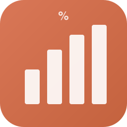
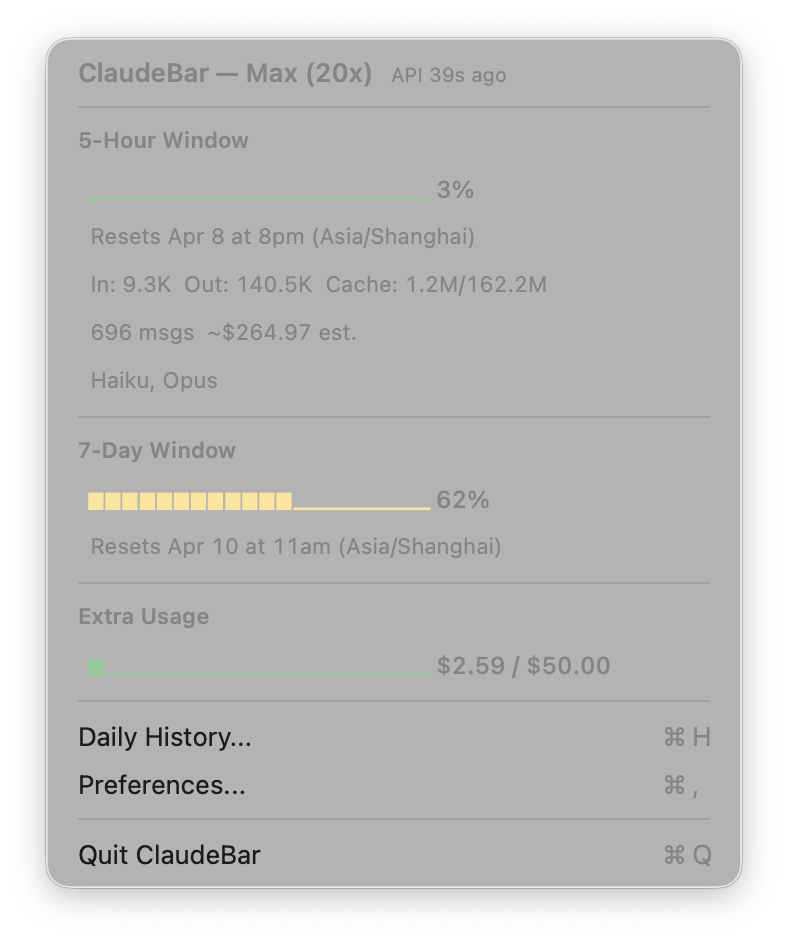
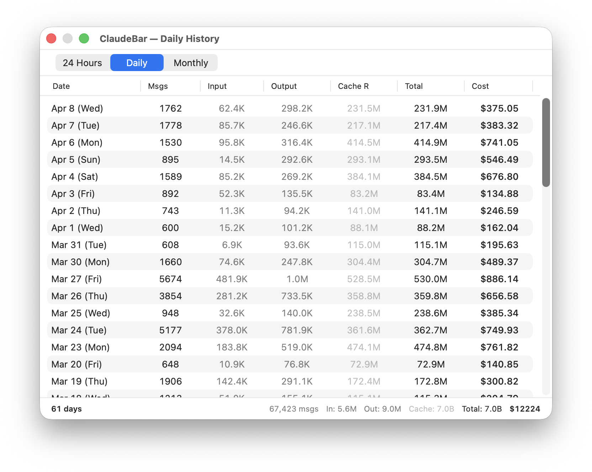

<p align="center">
  
</p>

<h1 align="center">ClaudeBar</h1>

<p align="center">
  <strong>macOS menu bar app for monitoring Claude Code usage and costs</strong>
</p>

<p align="center">
  <a href="https://github.com/gklab/ClaudeBar/releases/latest">
    
  </a>
  
  
</p>

---

ClaudeBar sits in your macOS menu bar and gives you a real-time view of your Claude Code usage across the 5-hour and 7-day rate limit windows. It reads data from the Claude OAuth API and local JSONL logs, so you always know how close you are to hitting your limits.

<p align="center">
  
  &nbsp;&nbsp;
  
</p>

## Features

- **Real-time usage monitoring** - 5-hour and 7-day rate limit windows with progress bars and reset countdowns
- **Auto-detect plan** - Reads your subscription type (Pro / Max 5x / Max 20x) from macOS Keychain
- **User profile** - Displays your account name from Claude's profile API
- **Token breakdown** - Input, Output, Cache Read/Write per session with model detection (Opus, Sonnet, Haiku)
- **Sonnet tracking** - Separate 7-day Sonnet utilization window when active
- **Extra Usage tracking** - Monitor your pay-as-you-go spending against your monthly limit
- **Daily History** - Browse usage across 24 Hours, Daily, and Monthly views with full token and cost breakdowns
- **Offline estimation** - When API is unavailable, estimates usage from local data using cost-based calibration
- **Disk cache** - Scans JSONL files incrementally; restarts are instant after the first run
- **Lightweight** - Pure AppKit menu bar app, ~1MB, no Dock icon, minimal CPU usage

## Installation

1. Download `ClaudeBar-macOS.zip` from [Releases](https://github.com/gklab/ClaudeBar/releases/latest)
2. Unzip and move `ClaudeBar.app` to `/Applications`
3. Double-click to launch - it appears in the menu bar only

Or build from source:

```bash
git clone https://github.com/gklab/ClaudeBar.git
cd ClaudeBar
swift build -c release
```

## Requirements

- macOS 14 (Sonoma) or later
- [Claude Code CLI](https://docs.anthropic.com/en/docs/claude-code) installed and logged in (`claude login`)

## How It Works

| Data Source | What | Frequency |
|-------------|------|-----------|
| **Claude OAuth API** | 5h/7d utilization %, reset times, extra usage, profile | On launch + every 5 min |
| **Local JSONL files** | Token breakdown (input/output/cache), cost estimates | Every 30s |
| **macOS Keychain** | Subscription plan, access token | On launch |

- The API is called at startup and refreshed every 5 minutes using ephemeral sessions to avoid rate limits
- Between API calls, usage is estimated locally using a cost-based calibration factor
- Historical data is cached to disk (`~/.claude/claudebar-cache.json`) for instant startup
- Cost shown is the equivalent API cost (what you would pay without a subscription)

## License

MIT
